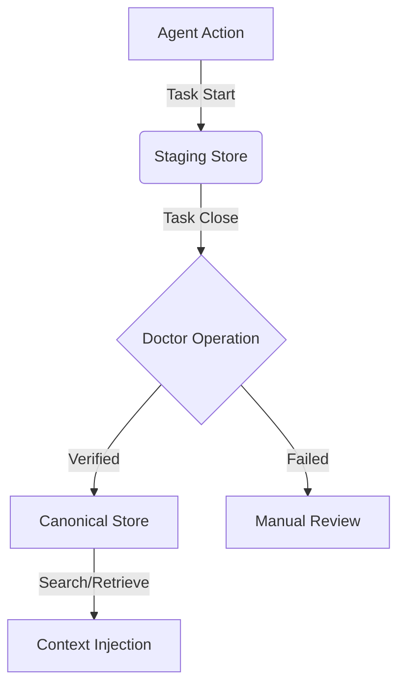

# ⚒️ Atlas Forge

**The Local-First Knowledge Orchestration Engine for AI Agents.**

Atlas Forge is a high-performance, developer-centric memory layer designed to bridge the gap between AI coding agents and persistent project knowledge. It manages structured, human-readable JSONL records within your repository, enabling agents to maintain context across tasks without network overhead or vendor lock-in.

[](https://www.npmjs.com/package/@thaild12042003/atlas-forge)
[](https://opensource.org/licenses/MIT)
[](https://nodejs.org)
[](http://makeapullrequest.com)

---

## 🚀 Key Features

- **📂 Local-First Storage**: All data lives in `.atlasforge/` as human-readable JSONL.
- **⚡ Atomic Operations**: Synchronous I/O primitives designed for high-concurrency agent environments.
- **🛡️ Task Lifecycle**: Built-in `TaskSession` management with automatic memory promotion and validation.
- **🔍 Lexical Retrieval**: Built-in similarity scoring and metadata filtering.
- **📦 Zero Config**: Initialize and start capturing project memory in under 5 seconds.

---

## 📦 Quick Start

### Installation

```bash
npm install @thaild12042003/atlas-forge
```

### CLI Usage

Initialize the forged core:
```bash
npx atlas-forge init
```

Start an active session:
```bash
npx atlas-forge task start "Implement user authentication"
```

Capture a technical decision:
```bash
npx atlas-forge add --type decision --title "JWT Auth" --summary "Using RS256 for secure tokens"
```

Close and Verify (Promotes to Canonical Store):
```bash
npx atlas-forge task close "Auth module completed"
```

## 🤖 AI Agent Integration (MCP)

Atlas Forge supports the **Model Context Protocol (MCP)**, allowing AI Agents (like Claude Desktop) to use the engine as their own project memory.

### Setup for Claude Desktop
Add the following to your `claude_desktop_config.json`:

```json
{
  "mcpServers": {
    "atlas-forge": {
      "command": "npx",
      "args": ["-y", "@thaild12042003/atlas-forge-mcp"]
    }
  }
}
```

### Available AI Tools
- `af_start_task`: AI will call this to begin a collaboration.
- `af_add_memory`: AI will automatically capture decisions and code patterns.
- `af_search`: AI will retrieve relevant past context for your questions.

For a detailed guide on how to configure various AI models, see [AI_PROTOCOL.md](file:///d:/DevProjects/Atlas%20Forge/AI_PROTOCOL.md).

---

## 🏛️ Architecture

Atlas Forge implements a dual-store architecture to separate "Working Memory" from "Long-term Knowledge".



- **Staging Store**: Holds "draft" or "verified" memories during an active task.
- **Canonical Store**: The "Gold Standard" knowledge base, optimized for retrieval.
- **Orchestrator**: Manages the transitions and validates data integrity.

---

## 🔮 Vision & Roadmap

Atlas Forge is evolving into a comprehensive Operating Layer for AI coding assistants.

### 📍 v0.2.0: Deep Integration
- [ ] **Git Adapter**: Automatic memory extraction from commits and diffs.
- [ ] **Freshness Engine**: Detect when memories become "stale" due to code changes.
- [ ] **Multi-Session Support**: Parallel task tracking for complex agents.

### 📍 v0.3.0: Intelligence Layer
- [ ] **Vector Search**: Conceptual similarity search using local embeddings (Orama/LanceDB).
- [ ] **LLM Summarization**: Automated memory entry drafting via Gemini/GPT-4o adapters.

### 📍 v0.4.0: Knowledge Mesh
- [ ] **Project Fingerprinting**: Global project metadata for better cross-repo context.
- [ ] **Visualizer**: Web-based dashboard for exploring the project knowledge graph.

---

## 🤝 Contributing

We welcome professional contributions. Please ensure all code passes the `npm run lint` and `npm test` suites before submitting a PR.

## 📄 License

MIT © 2026 [thaild12042003](https://github.com/thaildhe172591)
