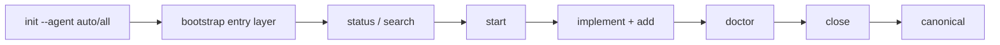

# Atlas Forge

Local-first memory orchestration for AI agents in real repositories.

[](https://www.npmjs.com/package/@thaild12042003/atlas-forge)
[](https://opensource.org/licenses/MIT)
[](https://nodejs.org)

## What's New in 0.4.7

- EN: Curated Superpowers vendor subset for professional profile, smaller and cleaner package surface.
- VN: Bộ vendor đã được curate có chủ đích cho profile professional, giảm nhiễu và nhẹ hơn khi phát hành.
- EN: `status --json` and `verify --json` now expose a compact `runtime_readiness_dashboard`.
- VN: `status --json` và `verify --json` đã có dashboard readiness ngắn theo từng runtime.
- EN: Legacy migration hardening for old/large repos with stricter config normalization behavior.
- VN: Tăng độ an toàn migration cho repo cũ/lớn với chuẩn hóa config chặt hơn.

## Quick Decision

| Need | Command | Expected JSON keys |
|---|---|---|
| Init one runtime | `npx atlas-forge init --agent codex --json` | `agent_profile`, `bootstrap.created`, `bootstrap.skipped` |
| Init full entry layer | `npx atlas-forge init --agent all --json` | `bootstrap.entrypoints`, `bootstrap.bridges`, `bootstrap.external_patch_files` |
| Re-sync safely | `npx atlas-forge optimize --agent all --dry-run --json` | `bootstrap.created`, `bootstrap.drifted`, `dry_run` |
| Check workspace health | `npx atlas-forge verify --agent auto --json` | `profile`, `selected_runtime_ready`, `runtime_readiness_dashboard`, `gaps` |
| Check live memory state | `npx atlas-forge status --agent auto --json` | `snapshot`, `promotion`, `runtime_readiness_dashboard`, `entrypoints` |

## One-Page Flow



## Runtime Readiness Dashboard

Use `verify --json` or `status --json` and read:

- `selected_runtime_ready`: runtime currently applied by profile is ready or not.
- `professional_kit_ready`: full multi-runtime kit readiness in professional mode.
- `runtime_readiness_dashboard.summary`: quick global count.

Sample shape:

```json
{
  "profile": "professional",
  "selected_runtime": "codex",
  "selected_runtime_ready": true,
  "professional_kit_ready": true,
  "runtime_readiness_dashboard": {
    "selected": { "agent": "codex", "ready": true, "patch_state": "required" },
    "agents": {
      "codex": { "ready": true, "patch_state": "required" },
      "claude": { "ready": true, "patch_state": "required" },
      "gemini": { "ready": true, "patch_state": "required" }
    },
    "summary": { "ready_count": 3, "total": 3, "not_ready": [] }
  }
}
```

## 60-Second Quickstart

```bash
npx atlas-forge init --agent auto --json
npx atlas-forge status --json
npx atlas-forge start "Implement feature X" --json
npx atlas-forge add --type decision --title "Key decision" --summary "Short reason" --json
npx atlas-forge doctor --json
npx atlas-forge close "Done" --json
```

## Agent Quickstart

| Agent | First command | Next command | Expected result |
|---|---|---|---|
| Codex | `npx atlas-forge init --agent codex --json` | `npx atlas-forge verify --agent codex --json` | CLI-first flow with readiness dashboard |
| Claude | `af_init` | `af_status` | MCP tools active, snapshot + readiness available |
| Gemini | `npx atlas-forge init --agent gemini --json` | `npx atlas-forge status --agent gemini --json` | Profile-specific docs + stable JSON health |

## Install

```bash
npm install @thaild12042003/atlas-forge
```

### Registry Matrix

| Registry | Package | Purpose |
|---|---|---|
| npmjs | `@thaild12042003/atlas-forge` | Standard CLI/MCP usage and CI |
| GitHub Packages | `@thaildhe172591/atlas-forge` | Repository package visibility and internal distribution |

## Publish in 60s

```bash
npm run lint
npm test
npm run test:smoke
npm run build
npm_config_cache=/tmp/.npm npm pack --dry-run
npm version patch
git push origin main --follow-tags
```

Tag push triggers `Publish Release Packages` workflow:
- publish npmjs package
- publish GitHub Packages package
- create/update GitHub Release

### Troubleshooting Order (Auth/Publish)

| Step | Symptom | Fix |
|---|---|---|
| 1 | `ENEEDAUTH` | ensure repo secret `NPM_TOKEN` exists and workflow uses it for npmjs |
| 2 | `EOTP` | recreate npm token with 2FA bypass enabled for automation |
| 3 | npmjs `E404` scoped package | use token from owner account of `@thaild12042003` scope |
| 4 | GitHub Packages missing | verify tagged run succeeded and job has `packages: write` |

## CLI Commands

All commands support `--json`.

| Command | Purpose |
|---|---|
| `atlas-forge init [--agent auto|all|claude|gemini|codex]` | Initialize workspace and entry layer |
| `atlas-forge optimize [--agent ...] [--dry-run]` | Re-sync managed artifacts without silent overwrite |
| `atlas-forge start <summary>` | Open task session |
| `atlas-forge add --title --summary [--type]` | Stage memory entry |
| `atlas-forge doctor` | Run diagnostics |
| `atlas-forge close <summary>` | Close task and promote valid entries |
| `atlas-forge search <query> [--limit]` | Search canonical memories |
| `atlas-forge status [--agent ...]` | Snapshot + readiness + entry-layer metadata |
| `atlas-forge verify [--agent ...]` | Structural checks + readiness checks |

## Best Skill Stack

| Agent | Stack | Best for |
|---|---|---|
| Codex | `systematic-debugging` + `writing-plans` + `verification-before-completion` | CLI implementation and release safety |
| Claude | `brainstorming` + `systematic-debugging` + `verification-before-completion` | MCP-first design and diagnosis |
| Gemini | `writing-plans` + `clean-code` + `verification-before-completion` | Minimal, structured CLI changes |
| Cursor | `brainstorming` + `documentation-templates` + `verification-before-completion` | IDE-native build + docs updates |
| Antigravity | `brainstorming` + `workflow-plan` + `verification-before-completion` | Long-running orchestration tasks |

## Guides

- Tutorial: [TUTORIAL.md](TUTORIAL.md)
- Release checklist: [docs/release-checklist.md](docs/release-checklist.md)
- Support matrix: [docs/agents/support-matrix.md](docs/agents/support-matrix.md)
- Prompt kit: [docs/agents/prompt-kit.md](docs/agents/prompt-kit.md)
- Codex: [docs/agents/codex.md](docs/agents/codex.md)
- Claude: [docs/agents/claude.md](docs/agents/claude.md)
- Gemini: [docs/agents/gemini.md](docs/agents/gemini.md)
- Cursor: [docs/agents/cursor.md](docs/agents/cursor.md)
- Antigravity: [docs/agents/antigravity.md](docs/agents/antigravity.md)

## License

MIT © 2026 thaild12042003
