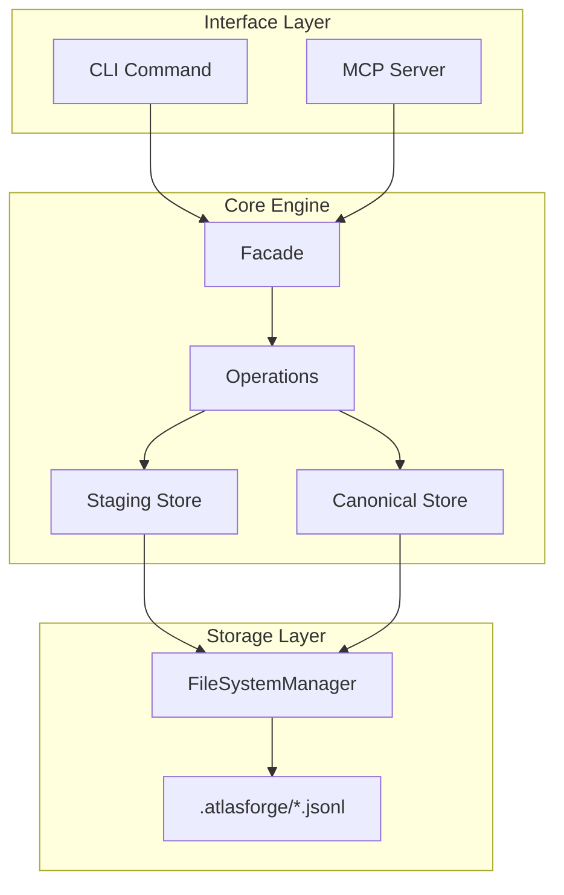
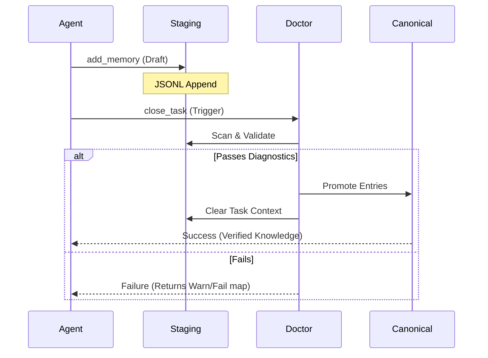

# ⚒️ Atlas Forge

**The High-Performance Knowledge Orchestration Engine for AI Agents.**

Atlas Forge is a developer-centric, local-first memory layer designed to give AI agents a persistent, structured, and human-readable memory of your codebase. It bridges the gap between deep technical decisions and the agents that implement them.

[](https://www.npmjs.com/package/@thaild12042003/atlas-forge)
[](https://opensource.org/licenses/MIT)
[](https://nodejs.org)

---

## 🗺️ Logic & Architecture

### System Architecture
Atlas Forge follows a strict 4-layer separation of concerns to ensure atomic I/O and predictable agent behavior.



### The "Forge Cycle"
How knowledge moves from a thought to a permanent project memory.



---

Generic vector databases are often "black boxes" for agents. Atlas Forge is different:
- **🗂️ Local-First**: Knowledge stays in your repo under `.atlasforge/`.
- **📖 Human-Readable**: All memories are stored as valid JSONL. You own your data.
- **⚡ Atomic & Fast**: Optimized synchronous I/O designed for high-concurrency agent workflows.
- **🛡️ Quality Controlled**: Built-in "Doctor" diagnostics to prevent memory corruption.

---

## ⏱️ The First 5 Minutes

### 1. Installation
```bash
npm install @thaild12042003/atlas-forge
```

### 2. Initialize the Forge
```bash
npx atlas-forge init
```
*Creates the `.atlasforge/` structure and a default `config.yaml`.*

### 3. Start your first session
```bash
npx atlas-forge start "Refactoring user authentication"
```

### 4. Capture Knowledge
Whenever you (or your agent) make a technical decision:
```bash
npx atlas-forge add --type decision --title "JWT over Session" --summary "Decided to use JWT for stateless scalability"
```

### 5. Finalize & Persist
```bash
npx atlas-forge close "Refactoring complete"
```

---

## 🤖 AI Agent Integration (MCP)

Atlas Forge is natively compatible with the **Model Context Protocol (MCP)**. This allows agents like Claude Desktop or Cursor to **automatically** read and write to your project memory.

### Quick Setup for Claude Desktop
Add this to your `claude_desktop_config.json`:

```json
{
  "mcpServers": {
    "atlas-forge": {
      "command": "npx",
      "args": ["-y", "@thaild12042003/atlas-forge-mcp"]
    }
  }
}
```

> [!TIP]
> Use [AI_PROTOCOL.md](file:///d:/DevProjects/Atlas%20Forge/AI_PROTOCOL.md) for advanced cross-agent orchestration rules.

---

## 📚 Further Reading
- [Detailed Tutorial](file:///d:/DevProjects/Atlas%20Forge/TUTORIAL.md): Best practices for memory management.
- [AI Protocol](file:///d:/DevProjects/Atlas%20Forge/AI_PROTOCOL.md): How to sync multiple AI models.
- [Architecture](file:///d:/DevProjects/Atlas%20Forge/README.md#architecture): In-depth look at stores and operations.

## 📄 License
MIT © 2026 [thaild12042003](https://github.com/thaildhe172591)
