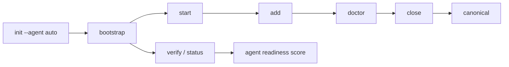

# Atlas Forge

Local-first memory orchestration for AI agents working in real codebases.

[](https://www.npmjs.com/package/@thaild12042003/atlas-forge)
[](https://opensource.org/licenses/MIT)
[](https://nodejs.org)

## Start Here

| If you want to... | Use this |
|---|---|
| Set up a new repo fast | `npx atlas-forge init --agent auto` |
| Work in the terminal with Codex or Gemini | `npx atlas-forge ... --json` |
| Use Claude or Cursor inside an IDE | MCP with `af_*` tools |
| Get ready-made prompts | [docs/agents/prompt-kit.md](docs/agents/prompt-kit.md) |

## Why Atlas Forge

Atlas Forge gives AI agents a persistent, inspectable memory layer inside your repository.

- Local data in `.atlasforge/`
- Adaptive agent bootstrap on `init --agent <auto|claude|gemini|codex>`
- JSONL storage for transparency
- Structured lifecycle: `start -> add -> doctor -> close`
- Dual interface: CLI and MCP

## Flow



## Quick Reference

| Need | Command | Expected output |
|---|---|---|
| Fresh workspace | `atlas-forge init --agent auto` | Creates `.atlasforge/` and agent guidance files |
| Re-sync assets | `atlas-forge optimize --agent auto --dry-run` | Shows created/skipped artifacts without writing |
| Check readiness | `atlas-forge verify --json` | Returns `agent_profile`, score, level, and gaps |
| Start work | `atlas-forge start <summary> --json` | Opens active session |
| Close work | `atlas-forge close <summary> --json` | Promotes valid staged entries to canonical |

## Install

```bash
npm install @thaild12042003/atlas-forge
```

## GitHub Packages

A GitHub Actions release workflow is included to publish the package to GitHub Packages so it appears in the repository's **Packages** tab.
This does not replace npmjs publishing; the release workflow now publishes to both registries in one run, using `NPM_TOKEN` for npmjs and `GITHUB_TOKEN` for GitHub Packages.
Recommended release flow:

```bash
npm version patch
git push origin main --follow-tags
```

Pushing the version tag triggers GitHub Actions to test, build, publish to npmjs, publish to GitHub Packages, and create the matching GitHub Release automatically.

## Recommended Setup

| Scenario | Best choice | Why |
|---|---|---|
| Team repo / CI | `npm i -D @thaild12042003/atlas-forge` | Locks the repo to one version and keeps `verify`/build reproducible |
| Daily local work | `npx atlas-forge ...` | Uses the repo version without a global install |
| Quick tryout | `npm i -g @thaild12042003/atlas-forge` | Fastest for experimenting across many repos |

## Best Skill Stack

| Agent | Best skill stack | Best for |
|---|---|---|
| Claude | `brainstorming` + `systematic-debugging` + `verification-before-completion` | MCP-first design, debugging, and clean handoff |
| Cursor | `brainstorming` + `documentation-templates` + `verification-before-completion` | IDE-native planning, docs, and ready checks |
| Codex | `systematic-debugging` + `writing-plans` + `verification-before-completion` | CLI-first feature work, bug fixes, and release safety |
| Gemini | `writing-plans` + `clean-code` + `verification-before-completion` | Structured CLI work with minimal maintainable changes |
| Antigravity | `brainstorming` + `workflow-plan` + `verification-before-completion` | Orchestrated tasks with strong promotion discipline |

## 60-second Quick Start

```bash
npx atlas-forge init --agent auto
npx atlas-forge start "Refactor auth module"
npx atlas-forge add --type decision --title "JWT over session" --summary "Stateless scaling requirement"
npx atlas-forge doctor
npx atlas-forge close "Refactor complete"
npx atlas-forge status
```

`init` and `optimize` are non-destructive: existing guidance/skill/workflow files are preserved.

## CLI Surface

All commands support `--json` for machine-readable automation.

| Command | Purpose |
|---|---|
| `atlas-forge init [--agent]` | Initialize `.atlasforge` and adaptive agent artifacts |
| `atlas-forge optimize [--agent] [--dry-run]` | Re-sync adaptive artifacts without overwriting user files |
| `atlas-forge start <summary>` | Start a task session |
| `atlas-forge add --title --summary [--type]` | Add memory to staging |
| `atlas-forge doctor` | Run diagnostics on staged entries |
| `atlas-forge close <summary>` | Close active task and promote |
| `atlas-forge search <query> [--limit]` | Search canonical memory |
| `atlas-forge status [--agent]` | Show snapshot + promotion + agent readiness |
| `atlas-forge verify [--agent]` | Verify workspace and report agent readiness score |

Promotion defaults to `direct` so valid staged entries are promoted to canonical on `close`.

Readiness fields in JSON output:
- `agent_profile` (`requested_agent`, `detected_agent`, `applied_agent`, `confidence`, `signals`)
- `agent_readiness_score` (0-10), `level` (`basic|good|excellent`), `gaps[]`

### Supported Memory Types

`onboarding`, `architecture`, `module`, `decision`, `bugfix`, `incident`, `task-note`, `policy`, `convention`, `code-pattern`

## MCP Setup (Claude Desktop / Cursor)

Use the published npm package:

```json
{
  "mcpServers": {
    "atlas-forge": {
      "command": "npx",
      "args": ["-y", "@thaild12042003/atlas-forge", "atlas-forge-mcp"]
    }
  }
}
```

Alternative (if your MCP host supports direct binary execution):

```json
{
  "mcpServers": {
    "atlas-forge": {
      "command": "atlas-forge-mcp",
      "args": []
    }
  }
}
```

### MCP Verification

1. Start MCP host with the config above.
2. Confirm tools are listed:
   `af_init`, `af_start_task`, `af_add_memory`, `af_search`, `af_close_task`, `af_status`.
3. Run `af_init` (optionally `{ "agent": "claude" }`) then `af_status` in a test workspace.

## Guides

- AI protocol: [AI_PROTOCOL.md](AI_PROTOCOL.md)
- Claude: [docs/agents/claude.md](docs/agents/claude.md)
- Cursor: [docs/agents/cursor.md](docs/agents/cursor.md)
- Codex: [docs/agents/codex.md](docs/agents/codex.md)
- Gemini: [docs/agents/gemini.md](docs/agents/gemini.md)
- Antigravity: [docs/agents/antigravity.md](docs/agents/antigravity.md)
- Prompt kit: [docs/agents/prompt-kit.md](docs/agents/prompt-kit.md)
- Agent support matrix: [docs/agents/support-matrix.md](docs/agents/support-matrix.md)
- Release checklist: [docs/release-checklist.md](https://github.com/thaildhe172591/Atlas-Force/blob/main/docs/release-checklist.md)
- Changelog: [CHANGELOG.md](CHANGELOG.md)

## License

MIT © 2026 thaild12042003
