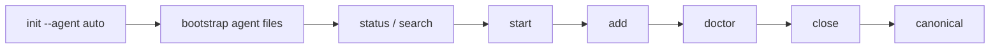

# Atlas Forge Tutorial

This tutorial helps users and agents adopt Atlas Forge in a predictable, production-friendly workflow.

## Learning Goals

After this guide, you can:

- initialize a workspace
- run a complete memory lifecycle
- debug failed promotions
- automate with JSON output

## Mental Model

Atlas Forge works with two memory zones:

- `staging`: draft memories during active work
- `canonical`: verified memories promoted for reuse

Lifecycle:

1. `start` task context
2. `add` decisions/patterns while implementing
3. `doctor` validate staging quality
4. `close` promote valid entries



## Agent Cheat Sheet

| Agent | First command | Follow-up | Expected result |
|---|---|---|---|
| Claude | `af_init` | `af_status` | MCP tools ready, active session visible |
| Cursor | `af_init` | `af_search` | MCP-first flow inside IDE |
| Codex | `atlas-forge init --agent codex --json` | `status -> start -> add -> doctor -> close` | CLI JSON flow with ready artifact set |
| Gemini | `atlas-forge init --agent gemini --json` | `optimize --agent gemini --json` | CLI-first, profile-specific guidance files |
| Antigravity | `atlas-forge init --agent auto --json` | `doctor` before `close` | Orchestrated CLI workflow with promotion discipline |

## Prompt Templates

Use these prompts to get consistent, high-signal output from Codex or other agents:

### 1) Repo Scan

```text
/init
Scan the repo before changing code.
Return:
1. architecture summary
2. main entrypoints and scripts
3. config and environment files
4. top technical risks
5. a short implementation plan
Do not edit files yet.
```

### 2) Bug Fix

```text
Use Atlas Forge.
Workflow:
status -> search -> start -> fix -> add memory -> doctor -> close
First identify the root cause, then patch the minimum safe change.
Run the relevant tests before closing.
```

### 3) Feature Work

```text
Use Atlas Forge for this feature.
Start by checking status and search.
Then propose the smallest implementation plan that preserves existing behavior.
Record key decisions with code-pattern memory entries.
Finish with doctor and close.
```

### 4) Release / Polish

```text
Use Atlas Forge in release mode.
Check status, verify, and existing docs first.
Improve user-facing guidance, examples, and prompts without changing core behavior.
Keep the output concise and publish-ready.
```

## Skill Combos

Atlas Forge works best when paired with a focused skill. Think of it like this:

| Task type | Good skill combo | Why it helps |
|---|---|---|
| New feature | `brainstorming` + `writing-plans` | Forces a clean design first, then turns it into steps |
| Bug fix | `systematic-debugging` + `verification-before-completion` | Finds the root cause and proves the fix before closing |
| Publish/release | `verification-before-completion` + `git-ops-pro` | Keeps the release clean and evidence-backed |
| Docs polish | `documentation-templates` + `clean-code` | Makes docs shorter, clearer, and easier to scan |

Example prompt:

```text
Use Atlas Forge with brainstorming and writing-plans.
First inspect the repo, then propose 2-3 approaches for this feature, wait for approval, and only then implement.
Track decisions in Atlas Forge, run doctor before close, and keep the output concise.
```

## Hands-on Walkthrough

### Step 1: Initialize

```bash
npx atlas-forge init --agent auto
```

Expected outcome:
- `.atlasforge/` created
- default `config.yaml` available
- shared `AGENTS.md` plus profile-specific root guidance (`CLAUDE.md`/`GEMINI.md`/`CODEX.md`) auto-created when missing
- `.atlasforge/skills/` + `.atlasforge/workflows/` seeded when missing

Optional re-sync (non-destructive):

```bash
npx atlas-forge optimize --agent auto --json
```

### Step 2: Start a Task Session

```bash
npx atlas-forge start "Implement billing retries"
```

Expected outcome:
- one active session
- preflight context loaded when available

### Step 3: Capture Knowledge During Work

```bash
npx atlas-forge add \
  --type decision \
  --title "Retry policy" \
  --summary "Use exponential backoff with jitter"
```

Use `code-pattern` for reusable templates:

```bash
npx atlas-forge add \
  --type code-pattern \
  --title "Idempotent retry wrapper" \
  --summary "Safe wrapper for retriable operations"
```

### Step 4: Validate Before Promotion

```bash
npx atlas-forge doctor
```

Expected outcome:
- diagnostics pass, warn, or fail
- actionable checks for bad entries

### Step 5: Close and Promote

```bash
npx atlas-forge close "Billing retry implementation complete"
```

## Automation Mode (`--json`)

For agents and scripts, always prefer machine-readable responses:

```bash
npx atlas-forge status --json
npx atlas-forge search "retry" --json
npx atlas-forge doctor --json
```

Quick decision rule:
- `init` or `optimize` when you need agent files and workflows created or re-synced.
- `verify` when you need readiness and config health.
- `status` when you need live counts plus agent readiness score.

## Troubleshooting

| Symptom | Cause | Fix |
|---|---|---|
| `Atlas Forge is not initialized` | missing `.atlasforge` | run `atlas-forge init` |
| invalid memory type | unsupported `--type` value | use supported types from `README.md` |
| doctor failures | malformed entry or bad evidence refs | inspect `doctor.checks`, repair entry, rerun |
| close does not promote expected records | promote mode or failed checks | run `status` + `doctor` to inspect state |

Note: new workspaces default to `promote_mode: direct`.

## Next Steps

- Read release gate: `docs/release-checklist.md`
- Configure MCP: `README.md` MCP section
- Pick agent-specific guide in `docs/agents/`
- Copy a starting prompt from `docs/agents/prompt-kit.md`
